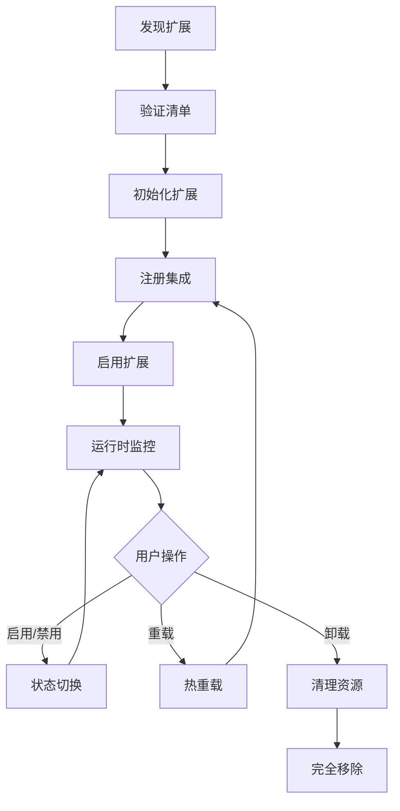
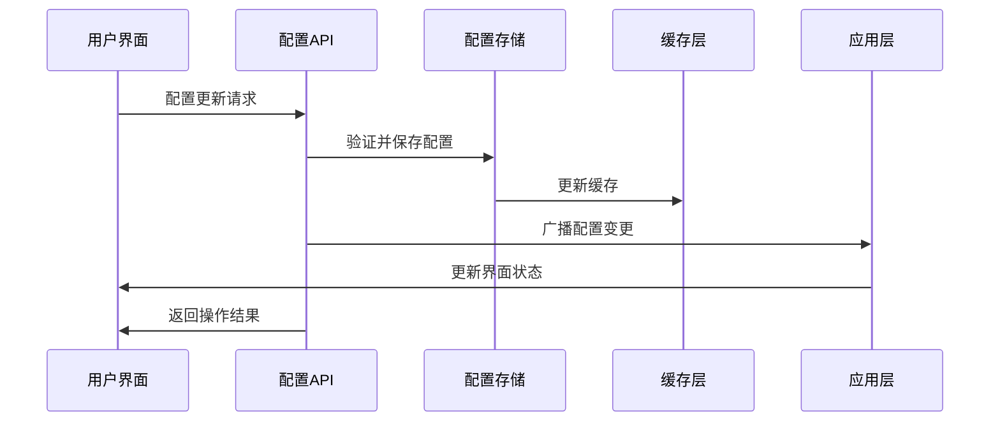

# VoxNest 插件系统架构设计

## 设计目标

### 核心目标
- **模块化**: 功能完全解耦，独立开发和部署
- **热插拔**: 运行时动态加载和卸载插件
- **标准化**: 统一的插件开发接口和规范
- **性能**: 最小化插件对系统性能的影响
- **全栈扩展**: 前后端统一的扩展架构

## 架构概览

### 整体架构
```
┌─────────────────────────────────────────────────────────────┐
│                     前端扩展框架                             │
├─────────────────────────────────────────────────────────────┤
│  Extension Framework │ Slot Manager │ Integration API       │
├─────────────────────────────────────────────────────────────┤
│  Extension Discovery │ Extension Loader │ Theme Manager     │
├─────────────────────────────────────────────────────────────┤
│                   VoxNest Core Framework                     │
├─────────────────────────────────────────────────────────────┤
│  Plugin Manager  │  Event Bus  │  Service Registry  │  API  │
├─────────────────────────────────────────────────────────────┤
│                    Plugin Runtime                           │
├─────────────────────────────────────────────────────────────┤
│  Plugin A  │  Plugin B  │  Plugin C  │  Plugin D  │  ...   │
└─────────────────────────────────────────────────────────────┘
```

### 前端扩展架构
```
┌─────────────────────────────────────────────────────────────┐
│                    React 应用层                              │
├─────────────────────────────────────────────────────────────┤
│  Slot Renderer │ Component Registry │ Route Manager        │
├─────────────────────────────────────────────────────────────┤
│              Extension Framework Core                       │
├─────────────────────────────────────────────────────────────┤
│  Integration Manager │ Lifecycle Hooks │ Context Provider   │
├─────────────────────────────────────────────────────────────┤
│               内置集成 (Built-in Integrations)               │
├─────────────────────────────────────────────────────────────┤
│  React │ DevTools │ Layout │ Style │ Router │ ...          │
├─────────────────────────────────────────────────────────────┤
│                   扩展发现与加载                             │
├─────────────────────────────────────────────────────────────┤
│  Extension Discovery │ Extension Loader │ Dynamic Import    │
└─────────────────────────────────────────────────────────────┘
```

## 前端扩展框架详细设计

### 核心概念

#### 1. 扩展框架 (Extension Framework)
扩展框架是前端插件系统的核心，负责管理扩展的生命周期、集成注册和组件槽位。

```typescript
interface ExtensionFramework {
  status: 'initializing' | 'ready' | 'error';
  config: VoxNestConfig;
  slots: SlotManager;
  integrations: IntegrationManager;
  logger: Logger;

  initialize(config?: VoxNestConfig): Promise<void>;
  register(integration: Integration): void;
  destroy(): Promise<void>;
  getStats(): any;
}
```

#### 2. 集成系统 (Integration API)
集成是可插拔的功能模块，通过钩子机制扩展框架功能。支持以下生命周期钩子：

- **framework:ready**: 框架初始化完成
- **components:ready**: 组件系统就绪  
- **app:start**: 应用启动前
- **app:started**: 应用启动后
- **app:destroy**: 应用销毁

```typescript
interface Integration {
  name: string;
  hooks?: {
    'framework:ready'?: (context: IntegrationContext) => void | Promise<void>;
    'components:ready'?: (context: IntegrationContext) => void | Promise<void>;
    'app:start'?: (context: IntegrationContext) => void | Promise<void>;
    'app:started'?: (context: IntegrationContext) => void | Promise<void>;
    'app:destroy'?: (context: IntegrationContext) => void | Promise<void>;
  };
}
```

#### 3. 槽位管理 (Slot Manager)
槽位系统允许在预定义的位置动态注册和渲染组件。

```typescript
interface SlotManager {
  register(slotId: string, registration: ComponentRegistration): void;
  unregister(slotId: string, source: string): void;
  unregisterBySource(source: string): void;
  getComponents(slotId: string): ComponentRegistration[];
  render(slotId: string, props?: any): React.ReactNode;
}
```

### 内置集成详解

#### 1. React 集成 (React Integration)
提供 React 特定的扩展支持，包括错误边界、悬念回退、开发工具等。

标准槽位：
- `react:error-boundary`: React 错误边界
- `react:suspense-fallback`: 悬念回退组件
- `react:dev-tools`: React 开发工具

#### 2. 布局集成 (Layout Integration)
定义标准的布局槽位体系，支持灵活的页面布局扩展。

标准槽位：
- `layout:header`: 页面头部
- `layout:header.left/center/right`: 头部区域细分
- `layout:sidebar`: 侧边栏
- `layout:sidebar.top/bottom`: 侧边栏区域细分
- `layout:content`: 主内容区
- `layout:content.before/after`: 内容区域扩展
- `layout:footer`: 页面底部
- `layout:footer.left/center/right`: 底部区域细分

#### 3. 样式集成 (Style Integration)
管理主题变量和动态样式注入。

CSS 变量：
```css
:root {
  --voxnest-primary: #1890ff;
  --voxnest-success: #52c41a;
  --voxnest-warning: #faad14;
  --voxnest-error: #f5222d;
  --voxnest-bg: #ffffff;
  --voxnest-text: #333333;
  --voxnest-border: #d9d9d9;
  --voxnest-radius: 6px;
  --voxnest-shadow: 0 2px 8px rgba(0,0,0,0.15);
}
```

#### 4. 开发工具集成 (DevTools Integration)
仅在开发模式下启用，提供调试和性能监控工具。

快捷键：
- `Ctrl+Shift+D`: 打开调试面板
- `Ctrl+Shift+S`: 查看框架状态

#### 5. 路由集成 (Router Integration)
支持路由变化监听和相关钩子。

标准槽位：
- `router:before-route-change`: 路由变化前
- `router:after-route-change`: 路由变化后
- `router:route-error`: 路由错误处理

### 扩展发现与加载

#### 扩展发现 (Extension Discovery)
自动发现 `/public/extensions` 目录中的插件和主题：

```
/public/extensions/
├── plugins/
│   └── example-plugin/
│       ├── manifest.json
│       ├── index.js
│       ├── plugin.js
│       └── styles.css
└── themes/
    └── dark-theme/
        ├── manifest.json
        └── theme.css
```

扩展清单格式：
```json
{
  "id": "example-plugin",
  "name": "示例插件",
  "version": "1.0.0",
  "type": "plugin|theme",
  "entry": "index.js",
  "styles": ["styles.css"],
  "scripts": ["plugin.js"],
  "config": {},
  "enabled": true
}
```

#### 扩展加载 (Extension Loader)
支持动态加载扩展资源：

1. **样式加载**: 动态创建 `<link>` 标签加载 CSS
2. **脚本加载**: 动态创建 `<script>` 标签加载 JS
3. **模块加载**: 使用动态 `import()` 加载 ES 模块
4. **实例注册**: 自动注册插件实例到框架

加载流程：
```
发现扩展 → 验证清单 → 加载资源 → 创建实例 → 注册到框架 → 执行初始化
```

## 插件生命周期

### 生命周期阶段
1. **Discovery**: 插件发现和扫描
2. **Loading**: 插件加载和初始化
3. **Activation**: 插件激活和注册
4. **Running**: 插件运行时管理
5. **Deactivation**: 插件停用和清理
6. **Unloading**: 插件卸载和资源释放

### 状态转换图
```
[Discovered] → [Loaded] → [Activated] → [Running]
     ↓             ↓           ↓           ↓
[Error]      [Error]    [Deactivated] → [Unloaded]
```

## 插件接口定义

### 核心接口

#### IPlugin 基础接口
```csharp
public interface IPlugin
{
    string Id { get; }
    string Name { get; }
    string Version { get; }
    string Description { get; }
    string Author { get; }
    
    Task<bool> InitializeAsync(IPluginContext context);
    Task<bool> StartAsync();
    Task<bool> StopAsync();
    Task<bool> UnloadAsync();
}
```

#### IPluginContext 上下文接口
```csharp
public interface IPluginContext
{
    IServiceProvider Services { get; }
    IConfiguration Configuration { get; }
    ILogger Logger { get; }
    IEventBus EventBus { get; }
    
    T GetService<T>() where T : class;
    void RegisterService<T>(T service) where T : class;
    void PublishEvent<T>(T eventData) where T : class;
    void SubscribeEvent<T>(Action<T> handler) where T : class;
}
```

### 扩展接口

#### IContentPlugin 内容插件接口
```csharp
public interface IContentPlugin : IPlugin
{
    string ContentType { get; }
    Task<ContentResult> CreateContentAsync(CreateContentRequest request);
    Task<ContentResult> UpdateContentAsync(UpdateContentRequest request);
    Task<ContentResult> DeleteContentAsync(DeleteContentRequest request);
    Task<ContentListResult> GetContentListAsync(GetContentListRequest request);
}
```

#### IUIPlugin 界面插件接口
```csharp
public interface IUIPlugin : IPlugin
{
    IEnumerable<RouteInfo> GetRoutes();
    IEnumerable<MenuInfo> GetMenuItems();
    IEnumerable<ComponentInfo> GetComponents();
    string GetClientScript();
    string GetClientStyles();
}
```

## 插件管理器

### 核心功能
```csharp
public interface IPluginManager
{
    // 插件发现和加载
    Task<IEnumerable<PluginInfo>> DiscoverPluginsAsync();
    Task<bool> LoadPluginAsync(string pluginId);
    Task<bool> UnloadPluginAsync(string pluginId);
    
    // 插件状态管理
    Task<bool> ActivatePluginAsync(string pluginId);
    Task<bool> DeactivatePluginAsync(string pluginId);
    PluginStatus GetPluginStatus(string pluginId);
    
    // 插件查询
    IEnumerable<IPlugin> GetActivePlugins();
    T GetPlugin<T>(string pluginId) where T : class, IPlugin;
    IEnumerable<T> GetPlugins<T>() where T : class, IPlugin;
}
```

### 插件发现机制
1. **文件系统扫描**: 扫描指定目录下的插件文件
2. **程序集反射**: 通过反射查找实现插件接口的类
3. **配置文件**: 通过配置文件指定插件列表
4. **在线商店（插件实现）**: 从插件商店下载和安装插件

## 事件总线系统

### 事件类型
```csharp
// 系统事件
public class SystemStartedEvent { }
public class SystemStoppingEvent { }

// 用户事件
public class UserRegisteredEvent 
{
    public int UserId { get; set; }
    public string Username { get; set; }
    public DateTime RegisterTime { get; set; }
}

// 内容事件
public class ContentCreatedEvent
{
    public int ContentId { get; set; }
    public string ContentType { get; set; }
    public int AuthorId { get; set; }
    public DateTime CreateTime { get; set; }
}
```

### 事件总线接口
```csharp
public interface IEventBus
{
    // 发布事件
    Task PublishAsync<T>(T eventData) where T : class;
    void Publish<T>(T eventData) where T : class;
    
    // 订阅事件
    void Subscribe<T>(Func<T, Task> handler) where T : class;
    void Subscribe<T>(Action<T> handler) where T : class;
    
    // 取消订阅
    void Unsubscribe<T>(Func<T, Task> handler) where T : class;
    void Unsubscribe<T>(Action<T> handler) where T : class;
}
```

## 前端插件系统实现

### 扩展框架初始化
```typescript
// 创建和初始化扩展框架
const framework = createExtensionFramework({
  appName: 'VoxNest',
  logLevel: 'debug',
  autoRegisterBuiltins: true,
});

// 注册自定义集成
framework.register(createCustomIntegration('my-plugin', {
  'components:ready': (context) => {
    context.slots.register('layout:header.right', {
      component: MyHeaderComponent,
      source: 'my-plugin',
      priority: 10,
    });
  }
}));

// 初始化框架
await framework.initialize();
```

### 扩展类型定义
```typescript
// 扩展清单类型
interface ExtensionManifest {
  id: string;
  name: string;
  version: string;
  author: string;
  description?: string;
  type: 'plugin' | 'theme';
  entry?: string;
  styles?: string[];
  scripts?: string[];
  dependencies?: string[];
  config?: Record<string, any>;
  enabled?: boolean;
}

// 组件注册类型
interface ComponentRegistration {
  component: React.ComponentType<any>;
  source: string;
  priority?: number;
  condition?: (props?: any) => boolean;
  props?: Record<string, any>;
  name?: string;
  description?: string;
}
```

### 槽位使用示例
```tsx
import { Slot } from '@voxnest/extension-framework';

// 在布局中使用槽位
export const Layout: React.FC = ({ children }) => {
  return (
    <div className="app-layout">
      <header className="header">
        <div className="header-left">
          <Slot id="layout:header.left" />
        </div>
        <div className="header-center">
          <Slot id="layout:header.center" />
        </div>
        <div className="header-right">
          <Slot id="layout:header.right" />
        </div>
      </header>
      
      <main className="main">
        <aside className="sidebar">
          <Slot id="layout:sidebar.top" />
          <Slot id="layout:sidebar" />
          <Slot id="layout:sidebar.bottom" />
        </aside>
        
        <div className="content">
          <Slot id="layout:content.before" />
          {children}
          <Slot id="layout:content.after" />
        </div>
      </main>
      
      <footer className="footer">
        <Slot id="layout:footer" />
      </footer>
    </div>
  );
};
```

### 扩展开发示例
```typescript
// 创建简单集成
const myIntegration = createSimpleIntegration(
  'my-feature',
  (context) => {
    context.logger.info('My feature initialized!');
    // 初始化逻辑
  }
);

// 创建组件集成
const myComponentIntegration = createComponentIntegration(
  'my-components',
  [
    {
      slotId: 'layout:header.right',
      component: MyHeaderWidget,
      priority: 5,
    },
    {
      slotId: 'layout:sidebar.top',
      component: MyNavigation,
      priority: 10,
    }
  ]
);

// 注册集成
framework.register(myIntegration);
framework.register(myComponentIntegration);
```

## 插件安全机制

### 权限控制
```csharp
public class PluginPermission
{
    public string PluginId { get; set; }
    public string Permission { get; set; }
    public bool IsGranted { get; set; }
}

public interface IPluginSecurity
{
    bool HasPermission(string pluginId, string permission);
    void GrantPermission(string pluginId, string permission);
    void RevokePermission(string pluginId, string permission);
    IEnumerable<string> GetRequiredPermissions(string pluginId);
}
```

### 沙箱隔离
- **程序集隔离**: 每个插件运行在独立的程序集上下文中
- **资源限制**: 限制插件的CPU、内存、网络使用
- **API访问控制**: 只允许访问授权的API和服务
- **文件系统隔离**: 限制插件的文件访问范围

## 插件配置管理

### 配置结构
```json
{
  "plugins": {
    "blog-plugin": {
      "enabled": true,
      "version": "1.0.0",
      "settings": {
        "maxPostLength": 10000,
        "allowComments": true,
        "moderationEnabled": false
      }
    },
    "forum-plugin": {
      "enabled": true,
      "version": "2.1.0",
      "settings": {
        "maxTopicsPerPage": 20,
        "allowAnonymousPosts": false
      }
    }
  }
}
```

### 配置接口
```csharp
public interface IPluginConfiguration
{
    T GetSetting<T>(string pluginId, string key, T defaultValue = default);
    void SetSetting<T>(string pluginId, string key, T value);
    void SaveSettings(string pluginId);
    void LoadSettings(string pluginId);
}
```

## 插件开发工具包

### 项目模板
```bash
# 创建新插件项目
dotnet new voxnest-plugin -n MyPlugin

# 项目结构
MyPlugin/
├── MyPlugin.csproj
├── Plugin.cs
├── Controllers/
├── Services/
├── Models/
├── Views/
└── plugin.json
```

### 开发工具
- **插件模板**: 插件模板仓库骨架
- **打包工具**: 插件打包和发布工具

## 性能优化

### 延迟加载
- 按需加载插件模块
- 异步初始化非关键插件
- 缓存插件元数据

### 资源管理
- 插件资源池化
- 内存使用监控
- 垃圾回收优化

### 并发控制
- 插件操作线程安全
- 异步事件处理
- 资源竞争避免

---

## 🆕 最新架构升级 ⭐ 2025年9月版本

### 扩展管理系统架构

#### 1. 实时状态管理架构
```typescript
interface ExtensionStateManager {
  // 扩展状态类型
  status: 'active' | 'inactive' | 'loading' | 'error';
  
  // 操作状态跟踪
  operatingExtensions: Set<string>;
  
  // 状态更新机制
  updateExtensionStatus(id: string, status: ExtensionStatus): void;
  
  // 批量状态管理
  batchUpdateExtensions(updates: ExtensionUpdate[]): void;
}
```

#### 2. 热重载系统优化架构
```typescript
class OptimizedHotReload {
  // 防抖机制
  private reloadTimers = new Map<string, number>();
  
  // 配置优化
  private config = {
    pollingInterval: 5000,    // 降低轮询频率
    debounceDelay: 2000,      // 防抖延迟
    maxRetries: 3,            // 重试机制
    watchPatterns: [          // 监控模式
      '/src/extensions/**/*.{ts,tsx,js,jsx}',
      '!/extensions/extensions.json'  // 排除配置文件
    ]
  };
  
  // 智能重载调度
  scheduleReload(extensionId: string, reason: ReloadReason): void;
  
  // 冲突检测和解决
  resolveReloadConflicts(): void;
}
```

#### 3. 扩展生命周期管理


### 统一配置管理架构

#### 1. 配置层级架构
```yaml
# 配置架构层级
VoxNest Configuration:
  ├── Frontend Settings
  │   ├── Theme Configuration
  │   ├── Layout Settings  
  │   ├── Performance Options
  │   └── UX Optimization
  ├── Backend Configuration
  │   ├── Server Settings
  │   ├── Database Config
  │   ├── CORS Configuration
  │   └── Logging Settings
  └── Extension Configuration
      ├── Plugin Settings
      ├── Theme Variables
      └── Integration Config
```

#### 2. 配置同步机制
```typescript
interface ConfigSyncManager {
  // 配置源
  sources: {
    frontend: FrontendConfigStore;
    backend: YAMLConfigService;
    extensions: ExtensionConfigRegistry;
  };
  
  // 同步策略
  syncStrategy: 'realtime' | 'batched' | 'manual';
  
  // 冲突解决
  conflictResolution: ConfigConflictResolver;
  
  // 变更传播
  propagateChanges(changes: ConfigChange[]): Promise<void>;
  
  // 回滚机制
  rollback(checkpoint: ConfigCheckpoint): Promise<void>;
}
```

#### 3. 实时配置更新流程


### 时区与国际化架构

#### 1. 时区服务架构
```csharp
public interface ITimeZoneService
{
    // 时区发现
    Task<IEnumerable<TimeZoneInfo>> GetAvailableTimeZonesAsync();
    
    // 时区验证
    Task<bool> ValidateTimeZoneAsync(string timeZoneId);
    
    // 时区设置
    Task<bool> SetTimeZoneAsync(string timeZoneId);
    
    // 时区转换
    Task<DateTime> ConvertToUserTimeZoneAsync(DateTime utcTime, string userTimeZone);
    
    // 当前时区
    Task<string> GetCurrentTimeZoneAsync();
}
```

#### 2. 国际化扩展架构
```typescript
interface LocalizationFramework {
  // 语言包管理
  languagePacks: Map<string, LanguagePack>;
  
  // 动态加载
  loadLanguagePack(locale: string): Promise<LanguagePack>;
  
  // 翻译服务
  translate(key: string, params?: object): string;
  
  // 格式化服务
  formatters: {
    date: DateFormatter;
    number: NumberFormatter;
    currency: CurrencyFormatter;
  };
  
  // 扩展国际化
  registerExtensionLocalization(
    extensionId: string, 
    localization: ExtensionLocalization
  ): void;
}
```

### 性能优化架构升级

#### 1. 智能缓存系统
```typescript
class IntelligentCacheSystem {
  // 多级缓存
  private caches = {
    memory: new Map<string, CacheEntry>(),
    redis: new RedisCache(),
    localStorage: new LocalStorageCache()
  };
  
  // 缓存策略
  private strategies = {
    extensionMetadata: 'memory+redis',
    configurationData: 'memory+localStorage',
    userPreferences: 'localStorage',
    temporaryData: 'memory'
  };
  
  // 智能失效
  invalidateSmartly(pattern: string, reason: InvalidationReason): void;
  
  // 预热机制
  preloadCriticalData(): Promise<void>;
}
```

#### 2. 资源优化架构
```typescript
interface ResourceOptimizer {
  // 代码分割
  codeSplitting: {
    chunkStrategy: 'extension' | 'feature' | 'route';
    lazyLoading: boolean;
    preloadCritical: boolean;
  };
  
  // 资源压缩
  compression: {
    gzip: boolean;
    brotli: boolean;
    imageOptimization: boolean;
  };
  
  // 网络优化
  networkOptimization: {
    http2: boolean;
    resourceHints: boolean;
    serviceWorker: boolean;
  };
}
```

### 安全架构增强

#### 1. 扩展沙箱机制
```typescript
class ExtensionSandbox {
  // 权限模型
  private permissions = new PermissionManager({
    api: ['read', 'write', 'execute'],
    storage: ['local', 'session', 'indexeddb'],
    network: ['fetch', 'websocket'],
    dom: ['query', 'modify', 'event']
  });
  
  // 资源隔离
  private isolation = {
    memory: new MemoryIsolator(),
    storage: new StorageIsolator(),
    network: new NetworkIsolator()
  };
  
  // 执行环境
  createIsolatedEnvironment(extensionId: string): IsolatedEnvironment;
  
  // 权限检查
  checkPermission(extensionId: string, action: Action): boolean;
}
```

#### 2. 配置安全验证
```csharp
public class ConfigurationSecurityValidator
{
    // 配置验证规则
    private readonly Dictionary<string, ValidationRule> _validationRules;
    
    // 安全检查
    public async Task<ValidationResult> ValidateConfigurationAsync(
        object configuration, 
        ConfigurationType type)
    {
        // 1. 类型安全检查
        var typeValidation = await ValidateTypeAsync(configuration, type);
        
        // 2. 值范围验证
        var rangeValidation = await ValidateRangesAsync(configuration);
        
        // 3. 安全策略检查
        var securityValidation = await ValidateSecurityPolicyAsync(configuration);
        
        return CombineValidationResults(typeValidation, rangeValidation, securityValidation);
    }
    
    // 敏感信息过滤
    public object FilterSensitiveInformation(object configuration)
    {
        // 移除密码、密钥等敏感信息
        // 返回安全的配置副本
    }
}
```

### 监控和诊断架构

#### 1. 实时监控系统
```typescript
interface RealTimeMonitoring {
  // 性能指标
  performanceMetrics: {
    extensionLoadTime: Map<string, number>;
    memoryUsage: MemoryTracker;
    cpuUsage: CpuTracker;
    networkLatency: NetworkTracker;
  };
  
  // 错误追踪
  errorTracking: {
    errorCount: Counter;
    errorTypes: Map<string, number>;
    stackTraces: ErrorLogger;
  };
  
  // 用户行为分析
  userBehaviorAnalytics: {
    extensionUsage: UsageTracker;
    featureAdoption: AdoptionTracker;
    performanceImpact: ImpactAnalyzer;
  };
}
```

#### 2. 诊断工具架构
```typescript
class DiagnosticToolsFramework {
  // 开发者工具
  private devTools = {
    extensionInspector: new ExtensionInspector(),
    performanceProfiler: new PerformanceProfiler(),
    memoryAnalyzer: new MemoryAnalyzer(),
    networkMonitor: new NetworkMonitor()
  };
  
  // 自动诊断
  private autoDiagnostics = {
    healthChecks: new HealthCheckRunner(),
    performanceTests: new PerformanceTestSuite(),
    compatibilityTests: new CompatibilityTester()
  };
  
  // 问题报告
  generateDiagnosticReport(): DiagnosticReport;
  
  // 性能建议
  generatePerformanceRecommendations(): PerformanceRecommendation[];
}
```

## 架构演进路线图

### 短期目标 (2025年Q4)
- ✅ 统一配置管理系统完善
- ✅ 扩展管理优化和稳定性提升  
- ✅ 时区功能和国际化基础
- 🔄 插件市场基础架构
- 🔄 高级权限管理系统

### 中期目标 (2026年Q1-Q2)
- 📋 微服务架构转型
- 📋 云原生部署支持
- 📋 AI辅助插件开发
- 📋 实时协作功能
- 📋 高级分析和监控

### 长期目标 (2026年Q3+)
- 📋 边缘计算支持
- 📋 区块链集成
- 📋 WebAssembly插件支持
- 📋 自动化测试和部署
- 📋 全球CDN分发